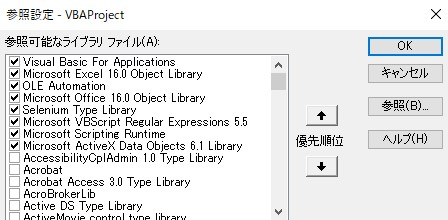

#CreateFile.xlsm  
## 環境構築  
1.以下URLインストーラを使用し、Seleniumをインストールする  
・<https://github.com/florentbr/SeleniumBasic/releases/tag/v2.0.9.0>  
2.以下URLから対応したChrome Driverをダウンロード  
・<https://sites.google.com/chromium.org/driver/downloads>  
※Chromeからバージョンを確認  
3.2でダウンロードしたChrome Driverを1でインストールした以下フォルダに配置する  
・C:\Users\[ユーザー名]\AppData\Local\SeleniumBasic  
4.NET.FrameWorkをインストールする  
※Seleniumを動かすのに必要なNET.FrameWorkの目的のバージョン  
※必要なバージョンの.NET Frameworkインストーラについては以下パス  
・C:\Users\[ユーザー名]\AppData\Local\SeleniumBasic\Scripts 内のStartChrome.vbs  
5.以下画像のようにExcelVBAの参照設定をする  

6.「CreateFile.xlsm」の同階層に「output」フォルダを作成  
